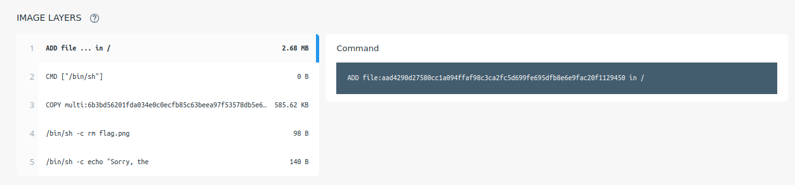
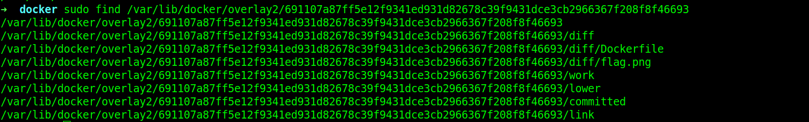
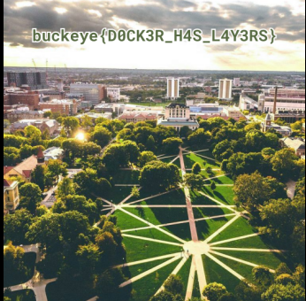

## layers

### Challenge Description

Check out my brand new docker repo https://hub.docker.com/r/qxxxb/layers  
  
### Writeup
This is a docker image. Use `docker pull qxxxb/layers:latest` and get it. You can also run it using `docker run -i -t qxxxb/layers:latest`.   
You can see that this image has 5 layers and in 4th layer a file called `flag.png` is removed.  
  
So we have to find the layers and look for this file in previous layers.  
If you navigate to `/var/lib/docker/image/overlay2/layerdb/sha256` you can see 4 other directories. Each of them has a directory named cache-id. I used the first cache-id to see its content:  
  
There is `flag.png`file in this layer. We just have to open it:  
```
sudo shotwell  /var/lib/docker/overlay2/691107a87ff5e12f9341ed931d82678c39f9431dce3cb2966367f208f8f46693/diff/flag.png
```  
Here is the result:  
  
