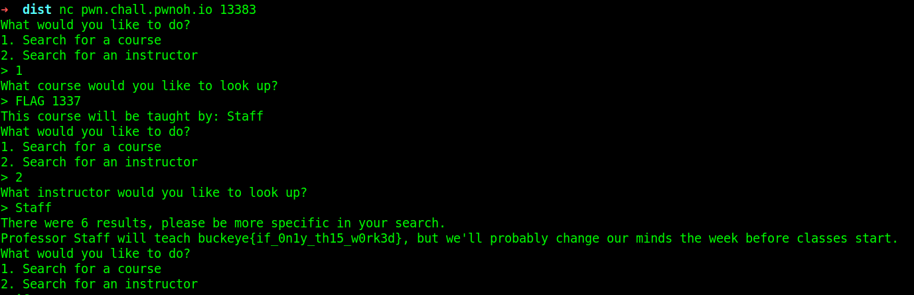

## Staff

### Challenge Description

Dr. Staff will see you now...   
`nc pwn.chall.pwnoh.io 13383`   

### Writeup
We are given a server address and a zip file containing its elf file and c code. This is a server that reads the content of a file (`sp22.txt`).  
```
CSE 2221
Bucci
CSE 2231
Bucci
CSE 2331
Zaccai
FLAG 1337
buckeye{this_is_a_fake_flag}
CSE 2421
Kirby
CSE 2431
Babic
```  
Every 2 lines of this file is a pair of a course and an instructor. We can use this server to search for the instructor name of a course or vice versa.  
We have two functions that handle these two cases. `find_course` and `find_instructor`. Both of them have two local variables with 0x20 bytes as their size.  
If we type `1` it will call the `find_course` function and will look for input entered as course to find its corresponding instructor. If there is such a course, the corresponding instructor will be stored in the second local variable of this function (It is the `instructor` variable).   
If we type `2` it will call the `find_instructor` function and will look for input entered as an instructor to find its corresponding course. If we just enter `Staff` as the input, it will print the second local variable of itself (It is the `course` variable).   
```c
printf("Professor %s will teach %s, but we'll probably change our minds the week before classes start.\n", instructor, course);
```   
What is inside this variable? It is the previously loaded `instructor` value in the previous function!  
So what should we do? After running the elf file, first, we enter `1` and give `FLAG 1337` as its input. This will load the flag to the second local variable. Then we type `2` and give `Staff` as its input. So the program will print the previously loaded value in the previous step which is the flag.  
  