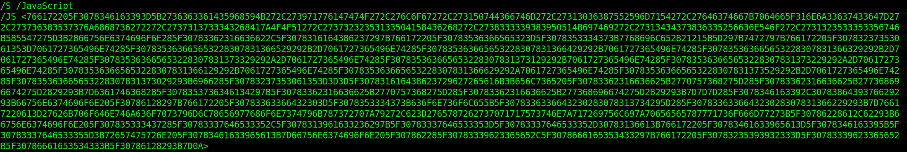
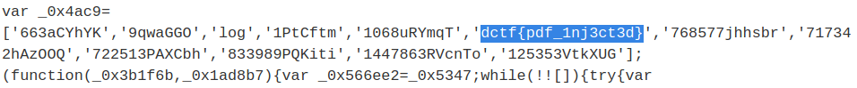

## Don't let it run

### Challenge Description  
PDF documents can contain unusual objects within.  

### Writeup
We are given a `pdf` file in this challenge. Run `strings` and you see a javascript part:  
  
This is a hex form. Decode it and you can see the flag in first lines:  
