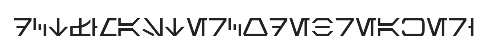

## Encrypted the flag I have

### Challenge Description  
Decrypted flag is not in exact format.  

### Writeup
We are given an image in this challenge that looks like a symbolic encryption.  

So we used [dcode](https://www.dcode.fr/en) site and checked all symbolic encryptions to find one that looks like elements inside given image. Here is a list of symbolic encryption methods: https://www.dcode.fr/tools-list#symbols  
The [aurebesh-alphabet](https://www.dcode.fr/aurebesh-alphabet) method is the symbolic method used for encryption in this challenge. Here is the flag:  
```
dctf{MASTERCODEBREAKER}
```