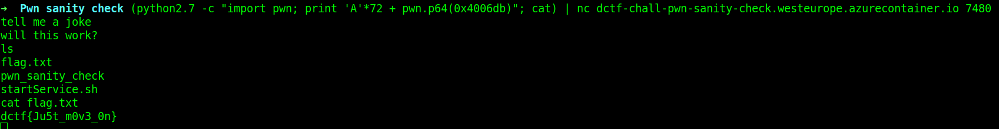

## Pwn sanity check

### Challenge Description  
This should take about 1337 seconds to solve.  
```nc dctf-chall-pwn-sanity-check.westeurope.azurecontainer.io 7480```

### Writeup
We are given a server and its binary file. We have 4 important functions: `main`, `vuln`, `shell` and `win`  
The `main` function calls `vuln` and it has a `gets` that get somthing as input. This is where we can enter our input. The `vuln` function calls `shell` which is not usefull for us. There is a `win` function that is not used anywhere. It needs two inputs and after checking two if conditions, it gives us shell access.  
We have to find the `ret` of `vuln` function and change it to the address that calls `system` in order to give us shell access. Here is the command:  
```
(python2.7 -c "import pwn; print 'A'*72 + pwn.p64(0x4006db)"; cat) | ./pwn_sanity_check
```
then use `ls` and you see there is a `flag.txt` file. use `cat` to see file content.  
