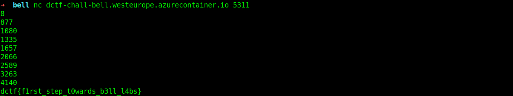

## Bell

### Challenge Description  
Blaise's friends like triangles too!  
```nc dctf-chall-bell.westeurope.azurecontainer.io 5311```
  
### Writeup
We are given a binary file. The `main` function gives us a number between from 8 to 12 and calls `process` function. There is a loop int his function that wants us to enter a number in each iteration. We have to calculate `triangle` result of printed int and loop counter.  
First we have to understant what is going on in `triangle`. Here is the code:  
```c
long triangle(uint uParm1,int iParm2)

{
  long lVar1;
  long lVar2;
  
  if ((int)uParm1 < iParm2) {
    lVar1 = 0;
  }
  else {
    if ((uParm1 == 1) && (iParm2 == 1)) {
      lVar1 = 1;
    }
    else {
      if (iParm2 == 1) {
        lVar1 = triangle((ulong)(uParm1 - 1),(ulong)(uParm1 - 1),(ulong)(uParm1 - 1));
      }
      else {
        lVar2 = triangle((ulong)uParm1,(ulong)(iParm2 - 1U),(ulong)(iParm2 - 1U));
        lVar1 = triangle((ulong)(uParm1 - 1),(ulong)(iParm2 - 1U),(ulong)(iParm2 - 1U));
        lVar1 = lVar1 + lVar2;
      }
    }
  }
  return lVar1;
}
```
This function is a recursive function that gets two args and calculates result. It is better to implement this function dynamically cause it takes too much to calculate in recursive mode.  
What does this function do? It takes agr1 and arg2.
```python
if(arg1 < arg2):
	arr[arg1][arg2] = 0
else:
	if(arg1 == 1 and arg2 == 2):
		arr[arg1][arg2] = 1
	else:
		if(arg2 == 1):
			arr[arg1][arg2] = arr[arg1-1][arg1-1]
		else:
			arr[arg1][arg2] = arr[arg1-1][arg2-1] + arr[arg1][arg2-1]
```
I computed this for num = 8 and just entered results for num = 8:  
```
1   0    0    0    0    0    0    0
1   2    0    0    0    0    0    0
2   3    5    0    0    0    0    0
5   7    10   15   0    0    0    0
15  20   27   37   52   0    0    0
52  67   87   114  151  203  0    0
203 255  322  409  523  674  877  0
877 1080 1335 1657 2066 2589 3263 4140
```
You just have to run the bin file, if it shows you 8, then enter these numbers at each line as input: 877, 1080, 1335, 1657, 2066, 2589, 3263, 4140
It gives you the flag:  
