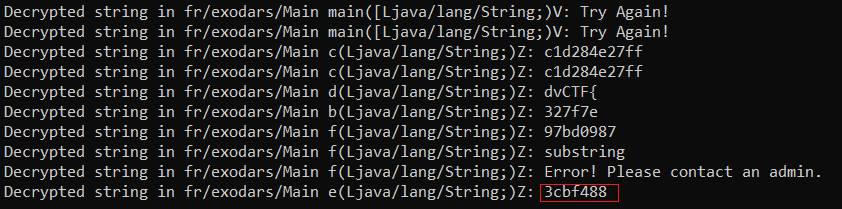

## Obfuscated 

### Challenge Description

My friend says that he used the best obfuscator. Can you prove him that he's wrong?      
  
### Writeup

We are given `file.jar` file which is obfuscated. I googled `java deobfuscator` ans found this link: [https://github.com/java-deobfuscator/deobfuscator](https://github.com/java-deobfuscator/deobfuscator)  
Follow the instructions:  
- Download the latest deobfuscator from [this link](https://github.com/java-deobfuscator/deobfuscator/releases)  
- Create `detect.yml` with the following contents  
```
input: file.jar
detect: true
```  
- Run `java -jar deobfuscator.jar --config detect.yml` to determine the obfuscators used.
It recommans us two transformers.  
```
[main] INFO com.javadeobfuscator.deobfuscator.Deobfuscator - Loading classpath
[main] INFO com.javadeobfuscator.deobfuscator.Deobfuscator - Loading input
[main] INFO com.javadeobfuscator.deobfuscator.Deobfuscator - Detecting known obfuscators
[main] INFO com.javadeobfuscator.deobfuscator.Deobfuscator -
[main] INFO com.javadeobfuscator.deobfuscator.Deobfuscator - RuleSuspiciousClinit: Zelix Klassmaster typically embeds decryption code in <clinit>. This sample may have been obfuscated with Zelix Klassmaster
[main] INFO com.javadeobfuscator.deobfuscator.Deobfuscator -    Found suspicious <clinit> in fr/exodars/a
[main] INFO com.javadeobfuscator.deobfuscator.Deobfuscator - Recommend transformers:
[main] INFO com.javadeobfuscator.deobfuscator.Deobfuscator - (Choose one transformer. If there are multiple, it's recommended to try the transformer listed first)
[main] INFO com.javadeobfuscator.deobfuscator.Deobfuscator -    None
[main] INFO com.javadeobfuscator.deobfuscator.Deobfuscator -
[main] INFO com.javadeobfuscator.deobfuscator.Deobfuscator - RuleEnhancedStringEncryption: Zelix Klassmaster has several modes of string encryption. This mode is similar to the simple mode, but adds an additional layer of decryption by calling a method with signature (II)Ljava/lang/String;
[main] INFO com.javadeobfuscator.deobfuscator.Deobfuscator -    Found potential enhanced string encrypted class fr/exodars/a
[main] INFO com.javadeobfuscator.deobfuscator.Deobfuscator - Recommend transformers:
[main] INFO com.javadeobfuscator.deobfuscator.Deobfuscator - (Choose one transformer. If there are multiple, it's recommended to try the transformer listed first)
[main] INFO com.javadeobfuscator.deobfuscator.Deobfuscator -    com.javadeobfuscator.deobfuscator.transformers.zelix.StringEncryptionTransformer
[main] INFO com.javadeobfuscator.deobfuscator.Deobfuscator -    com.javadeobfuscator.deobfuscator.transformers.zelix.string.EnhancedStringEncryptionTransformer
[main] INFO com.javadeobfuscator.deobfuscator.Deobfuscator - All detectors have been run. If you do not see anything listed, check if your file only contains name obfuscation.
[main] INFO com.javadeobfuscator.deobfuscator.Deobfuscator - Do note that some obfuscators do not have detectors.
```  

- Create `config.yml` with the following contents.  
```
input: file.jar
output: output.jar
transformers:
  - com.javadeobfuscator.deobfuscator.transformers.zelix.StringEncryptionTransformer
```  
- Run `java -jar deobfuscator.jar --config config.yml`. Here is the result. Also `output.jar` will be created.  
```
[main] INFO com.javadeobfuscator.deobfuscator.Deobfuscator - Loading classpath
[main] INFO com.javadeobfuscator.deobfuscator.Deobfuscator - Loading input
[main] INFO com.javadeobfuscator.deobfuscator.Deobfuscator - Computing callers
[main] INFO com.javadeobfuscator.deobfuscator.Deobfuscator - Transforming
[main] INFO com.javadeobfuscator.deobfuscator.Deobfuscator - Running com.javadeobfuscator.deobfuscator.transformers.zelix.StringEncryptionTransformer
[Zelix] [StringEncryptionTransformer] Starting
[Zelix] [StringEncryptionTransformer] Decrypted strings from 2 encrypted classes
[Zelix] [StringEncryptionTransformer] Decrypted 18 strings
[Zelix] [StringEncryptionTransformer] Done
[main] INFO com.javadeobfuscator.deobfuscator.Deobfuscator - Writing
Error: java/lang/reflect/InvocationTargetException could not be found while writing fr/exodars/Main. Using COMPUTE_MAXS
```  
Use `jd-gui` and decompile `output.jar`.  
```java
package fr.exodars;

import java.lang.reflect.InvocationTargetException;
import java.lang.reflect.Method;
import java.util.Scanner;

public class Main {
  private static final Scanner c = new Scanner(System.in);
  
  public static int b;
  
  public static int d;
  
  public static void main(String[] paramArrayOfString) {
    int i = d;
    try {
      System.out.println("Enter the password: ");
      Scanner scanner = new Scanner(System.in);
      String str1 = scanner.nextLine();
      String str2 = "a";
      try {
        if (((Boolean)a(str2, str1)).booleanValue())
          try {
            if (((Boolean)a("d", str1)).booleanValue())
              try {
                if (((Boolean)a("c", str1)).booleanValue())
                  try {
                    if (((Boolean)a("f", str1)).booleanValue())
                      try {
                        if (((Boolean)a("e", str1)).booleanValue())
                          try {
                            if (((Boolean)a("b", str1)).booleanValue()) {
                              try {
                                System.out.println("Congrats! You can validate the challenge with that flag!");
                                if (i != 0) {
                                  System.out.println("Try Again!");
                                  System.exit(1);
                                } 
                              } catch (NoSuchMethodException noSuchMethodException) {
                                throw null;
                              } 
                              return;
                            } 
                          } catch (NoSuchMethodException noSuchMethodException) {
                            throw null;
                          }  
                      } catch (NoSuchMethodException noSuchMethodException) {
                        throw null;
                      }  
                  } catch (NoSuchMethodException noSuchMethodException) {
                    throw null;
                  }  
              } catch (NoSuchMethodException noSuchMethodException) {
                throw null;
              }  
          } catch (NoSuchMethodException noSuchMethodException) {
            throw null;
          }  
      } catch (NoSuchMethodException noSuchMethodException) {
        throw null;
      } 
      System.out.println("Try Again!");
      System.exit(1);
    } catch (NoSuchMethodException|InvocationTargetException|IllegalAccessException noSuchMethodException) {
      System.out.println("Try Again!");
      System.exit(1);
    } 
  }
  
  public static Object a(String paramString1, String paramString2) throws NoSuchMethodException, InvocationTargetException, IllegalAccessException {
    Class clazz = Main.class;
    new Class[1][0] = String.class;
    paramString1;
    Method method = clazz.getMethod(a.b(paramString1, clazz, new Class[1]), new Class[1]);
    int i = d;
    method.setAccessible(true);
    if (i != 0) {
      int j = b;
      b = ++j;
    } 
    return method.invoke(null, new Object[] { paramString2 });
  }
  
  public static boolean c(String paramString) {
    String str = "c1d284e27ff";
    return paramString.substring(19, 30).equals("c1d284e27ff");
  }
  
  public static boolean a(String paramString) { return (paramString.length() == 39); }
  
  public static boolean d(String paramString) { return (paramString.substring(0, 6).equals("dvCTF{") && paramString.charAt(paramString.length() - 1) == '}'); }
  
  public static boolean b(String paramString) {
    String str = "327f7e";
    return (paramString.contains(str) && paramString.indexOf(str) == 6);
  }
  
  public static boolean f(String paramString) {
    String str = "97bd0987";
    Class clazz = String.class;
    try {
      Method method = clazz.getMethod("substring", new Class[] { int.class, int.class });
      method.setAccessible(true);
      String str1 = (String)method.invoke(paramString, new Object[] { Integer.valueOf(0), Integer.valueOf(paramString.length() - 1) });
      String str2 = (String)method.invoke(str1, new Object[] { Integer.valueOf(30), Integer.valueOf(str1.length()) });
      return str2.equals(str);
    } catch (Exception exception) {
      System.out.println("Error! Please contact an admin.");
      return false;
    } 
  }
  
  public static boolean e(String paramString) {
    // Byte code:
    //   0: getstatic fr/exodars/Main.d : I
    //   3: ldc '3cbf488'
    //   5: astore_2
    //   6: istore_1
    //   7: iconst_0
    //   8: istore_3
    //   9: iconst_0
    //   10: istore #4
    //   12: bipush #12
    //   14: istore #5
    //   16: iload #5
    //   18: bipush #12
    //   20: aload_2
    //   21: invokevirtual length : ()I
    //   24: iadd
    //   25: if_icmpge -> 59
    //   28: iload_3
    //   29: aload_2
    //   30: iload #4
    //   32: invokevirtual charAt : (I)C
    //   35: aload_0
    //   36: iload #5
    //   38: invokevirtual charAt : (I)C
    //   41: ixor
    //   42: iadd
    //   43: i2b
    //   44: istore_3
    //   45: iinc #4, 1
    //   48: iinc #5, 1
    //   51: iload_1
    //   52: ifne -> 67
    //   55: iload_1
    //   56: ifeq -> 16
    //   59: iload_3
    //   60: ifne -> 67
    //   63: iconst_1
    //   64: goto -> 68
    //   67: iconst_0
    //   68: getstatic fr/exodars/Main.b : I
    //   71: ifeq -> 81
    //   74: iinc #1, 1
    //   77: iload_1
    //   78: putstatic fr/exodars/Main.d : I
    //   81: ireturn
  }
}

```  
We see that all of the functions are decompiled except function `e`. After reading the code we can get each different part of the flag except the part relate to function `e`.  
```
dvctf{327f7e-------c1d284e27ff97bd0987}
```  
This time we edit `config.yml` with the second transformer. 
```
input: file.jar
output: output.jar
transformers:
  - com.javadeobfuscator.deobfuscator.transformers.zelix.string.EnhancedStringEncryptionTransformer
```
With the second transformer it was not able to decompile function `e` but it could find the string used in that function. 
  
So here is the final flag:  
```
dvctf{327f7e3cbf488c1d284e27ff97bd0987}
```
