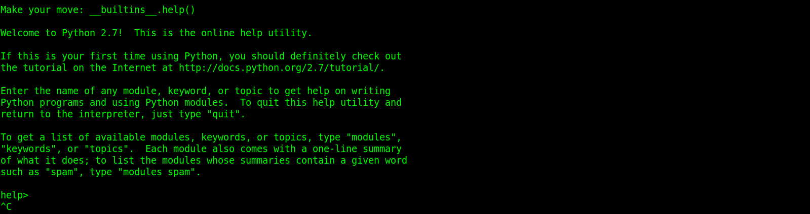
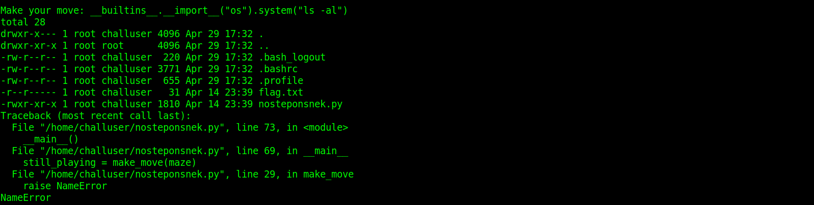
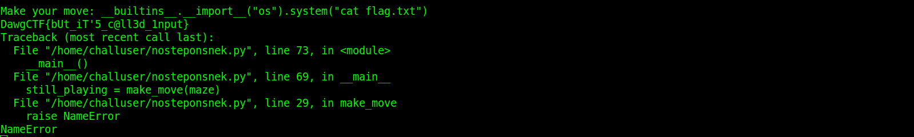

## NoStepOnSnek

### Challenge Description  
I heard you guys like python pwnables.  
`nc umbccd.io 4000`  

### Writeup
We are given a server address. When you connect to this server, it gives you a maze and it wants you to answer. Each time this maze changes. This server is written in python. So first we checked if we can use python `__builtins__`. 

So We can run commans using this capability. We ran `ls` to see files inside this directory. There is a `flag.txt` file. 

We executed `cat flag.txt` ans got the flag.  
