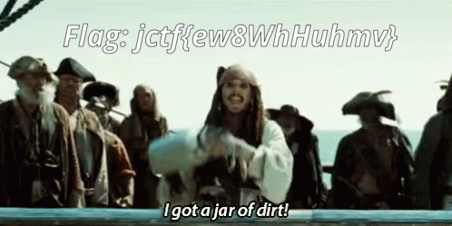

## file-zip-cracker

### Challenge Description  


- We have a secret file that is password protected. However, we have obtained a wordlist of actors that is part of the password. The password is the combination of one of the names on the list with a year.  
- Format: "Actor_NameYYYY" Example: "Henry_Cavill1964"  
- Fix the script to brute force the password.  

### Writeup
We are given a  `secret_folder.zip`, `actorList.txt`, and `FileZipCracker_Challenge_Version.py`.   
Editedt code:  
```python
import zipfile
import itertools
from itertools import permutations

def extractFile(zip_file, password):
    try:
        zip_file.extractall(pwd=password.encode())
        return True
    except KeyboardInterrupt:
        exit(0)
    except Exception as e:
        pass

zipfilename = 'secret_folder.zip'
actors = open("actorList.txt").read().split("\n")
print(actors)
for act in actors:
    zip_file = zipfile.ZipFile(zipfilename)
    for c in range(2000, 2050):
            password = act+''.join(str(c))
            print(c)
            # Try to extract the file.
            print("Trying: %s" % password)
            # If the file was extracted, you found the right password.
            if extractFile(zip_file, password):
                print('*' * 20)
                print('Password found: %s' % password)
                print('Files extracted...')
                exit(0)

print('Password not found.')

# res: Johnny_Depp2017
```
Unzip the zip file. You see message bellow and another zip file.  
```
Encoded Message:

Gur pbqr gb haybpx gur mvc svyr vf: v'ir_tbg_n_wne_bs_qveg_naq_thrff_jung'f_vafvqr_vg 
```  
Here is the decoded result:  
```
The code to unlock the zip file is: i've_got_a_jar_of_dirt_and_guess_what's_inside_it
```  
Use `i've_got_a_jar_of_dirt_and_guess_what's_inside_it` as the password of zip file. Extract it. You get a `Flag.mp3` file. But it can not be played with any tools. I opened it in 010Editor and saw that the header is `gif` file. So just changed the extention of `mp3` to `gif`. Here is the result:  
  