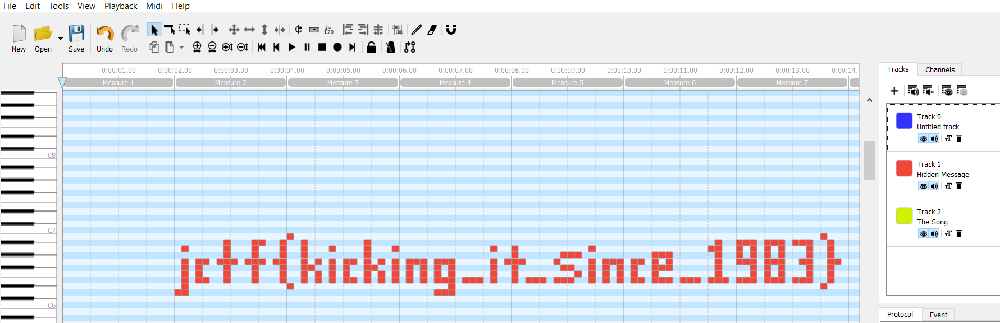

## speedy-at-midi

### Challenge Description  

Your partner-in-crime gets a hold of a MIDI file, riff.mid, which intelligence officials claim to contain confidential information. He has tried opening it in VLC Media Player, but it sounds just like the piano riff in riff.mp3. Can you find the right tool to extract the hidden data?  

### Writeup
We are given `riff.mid` and `riff.mp3`. We just need to install [midieditor](https://www.midieditor.org/) to see the flag.  
  