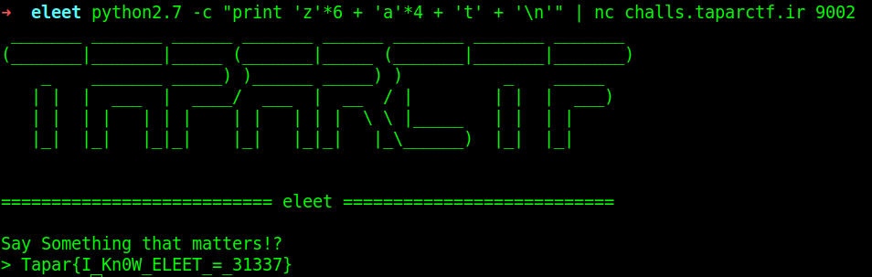

## eleet

### Challenge Description

Are you elite enough to catch the flag!?    
```
nc challs.taparctf.ir 9002
```  
Format: `Tapar{flag}`   

### Writeup

We are given an elf file and its corresponding server address. We have to enter some specifi charachter that sum of ascii code of them become 1236. These charachters are:  
```python
'z'*6 + 'a'*4 + 't'
```
This is the result:  
